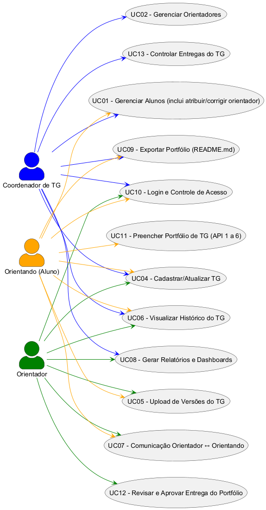

# Documentação de Casos de Uso - TGHUB

## Introdução

Este repositório contém a documentação dos casos de uso para o Sistema de Gerenciamento de Trabalhos de Graduação (TG), projetado para facilitar a gestão de alunos, orientadores e portfólios de TG na FATEC. O sistema inclui funcionalidades para cadastro, upload de versões, comunicação, relatórios e exportação de portfólios no formato README.md padrão da FATEC.

Os casos de uso são baseados em um diagrama de casos de uso (em PlantUML) e uma tabela detalhada de fluxos. A seguir, apresentamos os atores envolvidos e os detalhes de cada caso de uso.

## Atores

- **Coordenador de TG**: Responsável pela administração geral, como gerenciamento de alunos e orientadores, relatórios e controle de entregas.
- **Orientador**: Gerencia o TG dos alunos, aprova entregas, comunica-se com orientandos e visualiza históricos.
- **Orientando (Aluno)**: Realiza cadastros, preenche portfólios, faz uploads de versões e se comunica com o orientador.

## Diagrama de Casos de Uso - 

## Casos de Uso Detalhados

A seguir, uma tabela com os detalhes de cada caso de uso, incluindo ID, Nome, Atores, Pré-condições, Fluxo Principal e Pós-condições.

| ID    | Nome                                      | Atores                          | Pré-condições                                                                 | Fluxo Principal                                                                 | Pós-condições                          |
|-------|-------------------------------------------|---------------------------------|-------------------------------------------------------------------------------|---------------------------------------------------------------------------------|----------------------------------------|
| UC01 | Gerenciar Alunos (inclui atribuir/corrigir orientador) | Coordenador de TG, Aluno             | Sistema autenticado; usuário com perfil coordenador ou aluno em cadastro inicial | 1. Aluno realiza cadastro inicial e escolhe o Orientador numa lista (ChoiceBox). 2. Sistema registra aluno e vínculo com o orientador. 3. Se houver erro na escolha, o Coordenador acessa o cadastro do aluno, edita e corrige o orientador. | Aluno registrado no sistema, vinculado a um orientador correto. |
| UC02 | Gerenciar Orientadores                    | Coordenador de TG                     | Sistema autenticado, usuário com perfil coordenador                          | 1. Coordenador acessa módulo de orientadores. 2. Inclui, edita ou remove orientador. 3. Define área de atuação. | Orientador cadastrado/atualizado/removido. |
| UC04 | Cadastrar/Atualizar TG                    | Coordenador de TG, Orientador, Aluno | Aluno vinculado a orientador                                                 | 1. Acessa módulo TG. 2. Informa título, resumo, palavras-chave, estágio. 3. Salva. | TG registrado/atualizado no sistema.   |
| UC05 | Upload de Versões do TG                   | Orientador, Aluno               | TG já cadastrado                                                              | 1. Usuário acessa TG. 2. Envia nova versão (PDF, DOCX etc). 3. Sistema salva e atualiza histórico. | Nova versão vinculada ao TG.           |
| UC06 | Visualizar Histórico do TG                | Coordenador de TG, Orientador, Aluno | TG existente com versões cadastradas                                          | 1. Usuário acessa histórico. 2. Visualiza todas as versões, com datas e autores. 3. Pode baixar arquivos. | Histórico do TG exibido.               |
| UC07 | Comunicação Orientador ↔ Orientando      | Orientador, Aluno               | Ambos cadastrados e com TG ativo                                              | 1. Usuário acessa chat/mensagens. 2. Envia mensagem. 3. Sistema registra no histórico. 4. Destinatário recebe notificação. | Conversa registrada e acessível posteriormente. |
| UC08 | Gerar Relatórios e Dashboards             | Coordenador de TG, Orientador         | Sistema autenticado                                                           | 1. Usuário acessa relatórios. 2. Filtra por aluno/orientador/status. 3. Sistema gera gráficos e exportações. | Relatório/Dashboard gerado.            |
| UC09 | Exportar Portfólio (README.md)          | Coordenador de TG, Aluno              | Todas entregas do portfólio aprovadas                                       | 1. Usuário acessa tela de exportação. 2. Sistema gera README.md no padrão Fatec. 3. Arquivo disponível para download. | README.md exportado para repositório do aluno. |
| UC10 | Login e Controle de Acesso                | Todos                           | Usuário já cadastrado                                                         | 1. Usuário acessa tela de login. 2. Informa e-mail e senha. 3. Sistema valida credenciais. 4. Redireciona conforme perfil. | Usuário autenticado com permissões definidas. |
| UC11 | Preencher Portfólio de TG (API 1 a 6)   | Aluno                           | Login válido, TG vinculado a orientador                                       | 1. Aluno acessa formulário. 2. Preenche seção correspondente (API1, API2…). 3. Submete para revisão. | Entrega registrada no sistema.         |
| UC12 | Revisar e Aprovar Entrega do Portfólio  | Orientador                      | Entrega submetida pelo aluno                                                  | 1. Orientador acessa seção submetida. 2. Lê conteúdo. 3. Registra feedback. 4. Aprova ou pede ajustes. | Entrega aprovada ou devolvida para correção. |
| UC13 | Controlar Entregas do TG                  | Coordenador de TG                     | Alunos e orientadores cadastrados                                             | 1. Coordenador acessa dashboard. 2. Visualiza status de cada aluno (quantas entregas, quais aprovadas). 3. Filtra por curso/orientador. | Relatório de status das entregas disponível. |

## Observações

- O sistema segue o padrão de portfólio da FATEC, com foco em APIs de 1 a 6 para o preenchimento de portfólios.
- Para mais detalhes sobre implementação, consulte os arquivos de código no repositório.

